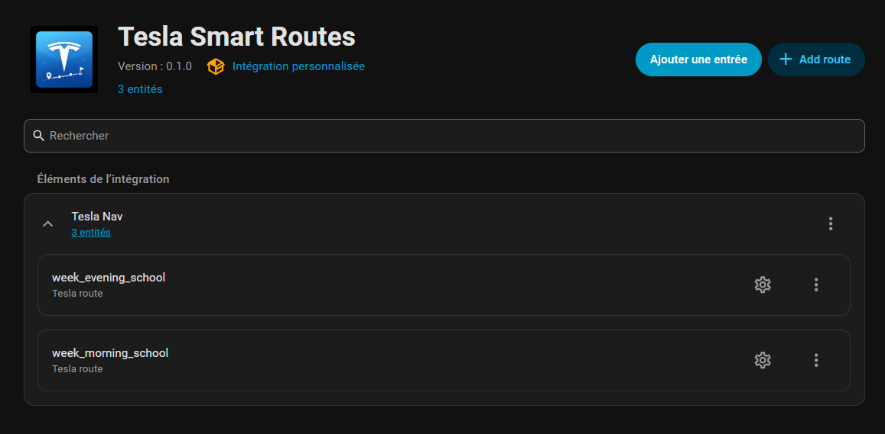
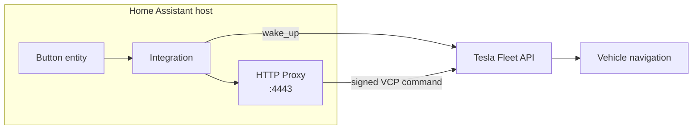

# Tesla Smart Routes

[](https://github.com/Briochorama/tesla-smart-routes/releases)
[](https://hacs.xyz)
[](https://www.home-assistant.io/)
[](LICENSE)

Every morning. Drop one kid at school, another at the nursery, then head to the office. Every day the same trip, every day the same tapping on the Tesla screen to set naviguation with waypoints.

Tesla Smart Routes lets you save those trips once. When you get in the car, press a button in Home Assistant (or let an automation do it for you) and the full multi-stop route appears on your navigation screen instantly. No typing, no searching, no fiddling with the touchscreen while the kids are yelling.



---

## How it works



1. You configure one or more **routes**, each with a name, a target vehicle (VIN), and a list of waypoints (Google Maps Place IDs)
2. Each route becomes a **button entity** in Home Assistant
3. Pressing the button wakes the vehicle if needed, then sends the waypoints to the Tesla navigation screen
4. Use **HA automations** to press the button on a schedule (e.g. every weekday morning at 7:30)

---

## Setup overview

The full setup spans this integration and the **[Tesla Smart Routes Add-on](https://github.com/Briochorama/tesla-smart-routes-addon)**. Follow this order — do not skip ahead:

1. [Generate your EC key pair](https://github.com/Briochorama/tesla-smart-routes-addon#step-2-generate-your-tesla-key-pair)
2. [Host the public key on GitHub Pages](https://github.com/Briochorama/tesla-smart-routes-addon#step-3-host-the-public-key) — this gives you your domain (e.g. `yourusername.github.io`)
3. **Create your Tesla Developer App** — you need the domain from step 2 (see Prerequisites below)
4. [Install the add-on and copy `private.pem` to HA](https://github.com/Briochorama/tesla-smart-routes-addon#step-1-add-custom-repository)
5. [Pair each vehicle with your key](https://github.com/Briochorama/tesla-smart-routes-addon#step-6-pair-the-key-with-your-vehicle)
6. [Start the add-on](https://github.com/Briochorama/tesla-smart-routes-addon#step-7-start-the-add-on)
7. **Install and configure this integration** (see below)

---

## Prerequisites

### 1. A Tesla Developer App

> Complete [add-on README Steps 2-3](https://github.com/Briochorama/tesla-smart-routes-addon#step-2-generate-your-tesla-key-pair) first. You need the GitHub Pages domain from Step 3 before filling out this form.

- Go to [developer.tesla.com](https://developer.tesla.com), sign in, and create an application
- Note the **Client ID** and **Client Secret**
- Under **Allowed origins**, set your GitHub Pages domain (e.g. `https://yourusername.github.io`) — this is the domain from add-on Step 3
- Under **Allowed redirect URIs**, add exactly: `https://my.home-assistant.io/redirect/oauth`
- Required scopes: `openid offline_access vehicle_cmds vehicle_location vehicle_device_data`

### 2. The Tesla Smart Routes Add-on
The integration sends commands through a local proxy that cryptographically signs them. Tesla requires this for all vehicle commands since 2023.

Install and configure the **[Tesla Smart Routes Add-on](https://github.com/Briochorama/tesla-smart-routes-addon)** first. It runs entirely on your Home Assistant host and exposes the proxy on port 4443.

---

## Installation

### HACS (recommended)

1. Open HACS, go to Integrations, click the three-dot menu and select **Custom repositories**
2. Add `https://github.com/Briochorama/tesla-smart-routes`, category: **Integration**
3. Search for **Tesla Smart Routes** and install
4. Restart Home Assistant

### Manual

Copy the `custom_components/tesla_smart_routes/` folder into your HA `config/custom_components/` directory, then restart.

---

## Setup

1. Go to **Settings > Devices & Services > + Add Integration > Tesla Smart Routes**
2. Enter your Tesla Developer App credentials:
   - **Client ID** and **Client Secret** from the Developer Portal
   - **Proxy URL**: `https://localhost:4443` (default if the add-on runs on the same host)
3. Click **Submit**. A Tesla login window will open.
4. Sign in with the Tesla account linked to your vehicle
5. Authorize the requested permissions
6. You will be redirected back to Home Assistant

> **Nabu Casa users**: when the `my.home-assistant.io` page shows "localhost:8123", click the pencil icon and enter your Nabu Casa URL instead.

---

## Adding routes

After setup, click **Add entry** next to the Tesla Smart Routes integration:

1. **Route name**: e.g. `school_morning`
2. **Vehicle**: enter the VIN manually, or select a HA entity whose state is the VIN
3. **Waypoints**: add stops one by one:
   - **Label**: a human-readable name (e.g. `School`)
   - **Place ID**: the Google Maps Place ID for that location (see below)
   - Choose **Add another** or **Done** when finished

A button entity named after the route will appear under the integration.

### Finding Google Maps Place IDs

1. Open [Google Maps](https://maps.google.com) and find the location
2. Right-click the pin and copy the coordinates, or use the [Place ID Finder tool](https://developers.google.com/maps/documentation/javascript/examples/places-placeid-finder)
3. Alternatively: open the location in Maps and look at the URL. The `place_id` parameter is what you need.

Place IDs look like `ChIJN1t_tDeuEmsRUsoyG83frY4`.

---

## Editing routes

Click the **pencil icon** on any route entry:

- **Edit route name**: rename the route
- **Edit vehicle**: change VIN or switch to entity-based VIN
- **Manage waypoints**: add, edit, or delete individual stops

---

## Scheduling with automations

The integration does not store a schedule. Use Home Assistant automations instead.

**Example: send school route every weekday at 7:30**

```yaml
alias: School morning route
trigger:
  - platform: time
    at: "07:30:00"
condition:
  - condition: time
    weekday: [mon, tue, wed, thu, fri]
action:
  - action: button.press
    target:
      entity_id: button.school_morning
```

Create this in **Settings > Automations > + New Automation**, or paste the YAML directly in the YAML editor.

---

## Troubleshooting

**Button press has no effect / logs show "vehicle offline"**
The car has no cellular connection (parking underground, faraday cage, etc.). The integration cannot wake a truly offline vehicle. This is a Tesla limitation.

**Button press times out after 120s**
The vehicle is asleep but waking took longer than expected. Check your Tesla app. If the car shows as online there, try again.

**OAuth error 400 / redirect_uri mismatch**
The redirect URI `https://my.home-assistant.io/redirect/oauth` is not listed in your Tesla Developer App. Add it under **Allowed redirect URIs** in the Tesla Developer Portal.

**Entities not visible after adding first route**
Reload the integration: **Settings > Integrations > Tesla Smart Routes > three-dot menu > Reload**.

**"proxy_url" connection refused**
The Tesla Smart Routes Add-on is not running. Check its logs in **Settings > Add-ons > Tesla HTTP Proxy**.

---

## Vehicle pairing

Before the proxy can send commands to a vehicle, the vehicle must have the proxy's public key installed. This is a one-time step per vehicle and **requires you to be physically inside the car with your key card**.

See the [Tesla Smart Routes Add-on README](https://github.com/Briochorama/tesla-smart-routes-addon) for the full pairing procedure.

---

## License

MIT. See [LICENSE](LICENSE)
